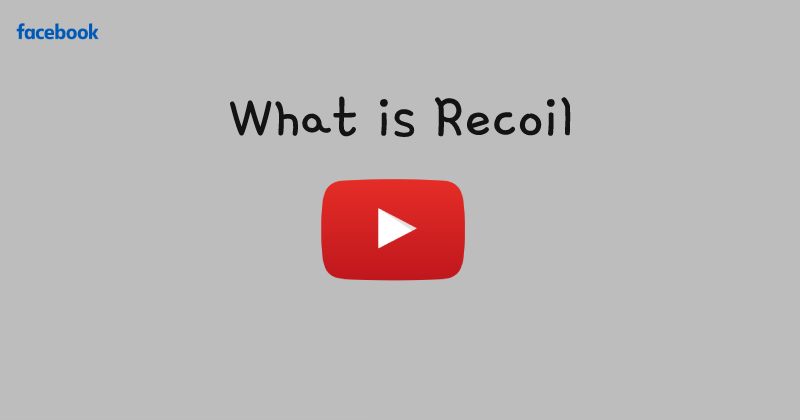
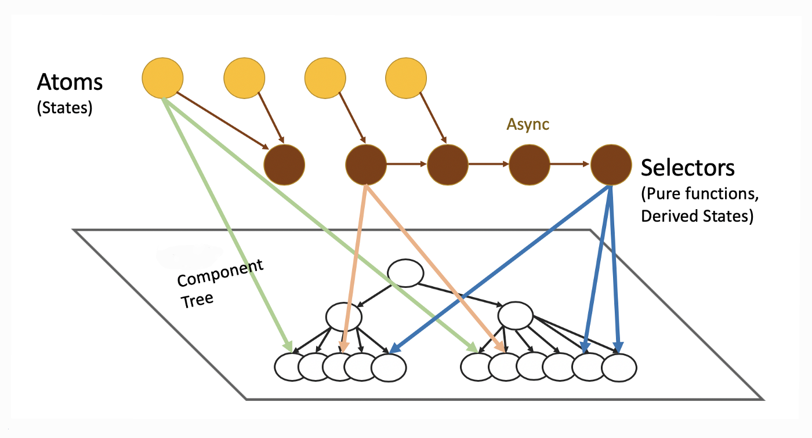

# RecoilSwift

[](https://github.com/hollyoops/recoilswift)
[](https://github.com/hollyoops/recoilswift)
[](https://github.com/hollyoops/RecoilSwift/actions/workflows/main.yml)
[](https://codecov.io/gh/hollyoops/RecoilSwift)


RecoilSwift是一个针对`SwiftUI`的轻量级、可组合的状态管理框架，同时兼容`UIKit`。它可以作为传统的`MVVM`或者`Redux-like`架构方案（如:`reswift`、`TCA`）的替代者。

> **注意：** 从0.3版本开始，RecoilSwift已经支持了`UIKit`。如果你想在`UIKit`中使用RecoilSwift，你可以查看master分支的例子。但需要注意的是，我们目前仍处于beta阶段，未来的接口可能会有所调整。

## Recoil概览

`Recoil`是由`Facebook`提出的一种可组合的应用状态管理方案。它简化了`Redux`，可以作为`Redux`的优雅替代者。

想要更快速的了解Recoil，你可以观看下面的视频，或者访问[官网](https://recoiljs.org/)。

[](https://www.youtube.com/watch?v=_ISAA_Jt9kI)

## 动机

当前的iOS架构模式（如:`MVVM`）在配合声明式编程时存在一些问题，而且痛点众多。因此，在声明式的UI框架中，很多开发者更倾向于选择`Redux-like`的状态管理架构方案（如:`ReSwift`、`TCA`）。但`Redux`方案复杂，学习成本较高，同时模板代码过多，写起来比较累。`Recoil`应运而生，它主要有以下特点：

- 概念简单，易于上手  
- 原子化状态，状态可组合  
- 响应式编程  
- 声明式编程，无模板代码，降低代码量

使用Recoil后，代码会变得更加简洁，同时不同的组件可以非常方便地共享状态。

## API 文档

:closed_book: [**API 文档**](https://recoilswift-hollyoops.netlify.app/)

## 基本概念

在Recoil中，有两个基本的概念：

1. 原子（`Atoms`）：原子是状态的基本单元，是一种有状态的对象。原子可以被读取和写入，其类型可以是任意数据类型。
2. 选择器（`Selectors`）：选择器从一个或多个原子中派生出新的状态，这种派生状态可以被订阅以获取状态的更新，它们也可以作为其他选择器的输入。

通常，我们会在`Atoms`中存放源数据，在`selector`中放置业务逻辑。而选择器的业务单元是可以被组合的。如下图所示：



上图中， 黄色的是`Atoms`, 棕色的是 `Selectors`， 箭头表示状态的组合，依赖关系。

- `Atom`不能依赖其他`Atom` 。
- `Selector` 可以组合其他 `Selector` 或 `Atom` 并自动建立依赖关系，它是响应式的，任何上游的值变动，下游的选择器都会自动重新执行求值

**总而言之：**

- Recoil的状态是原子化的，可以轻松地组合和重用。
- Recoil的状态是响应式的，自动建立依赖关系。任何上游的值变动，下游的选择器都会自动重新执行计算逻辑，获取最新的值，并刷新UI。
- Recoil的状态独立于UI组件，轻松实现跨组件的状态共享。

这三个特性使你的代码更加简洁，同时提高了代码的重用性。

## 安装

- 前置条件： iOS 13+，Xcode 14.3+
  
- [**Swift Package Manager**](https://swift.org/package-manager/)

```swift
.Pagckage(url: "https://github.com/hollyoops/RecoilSwift.git", from: "master")
```

- [**CocoaPods**](https://cocoapods.org) 

你也可以用CocoaPods安装

```ruby
pod 'RecoilSwift'
```

## 基本用法

你可以在 `UIKit` 和 `SwiftUI` 中使用 RecoilSwift。

(在UIKit中 使用RecoilSwift, **请查看 [更多用法](#更多用法)**)

### 在SwiftUI中 使用RecoilSwift

在 SwiftUI 中，RecoilSwift 提供了两类方式的 API：基于 `PropertyWrapper` 的 API 和基于 Hooks 的 API。`PropertyWrapper`API 更符合 iOS 规范，更适合原生开发者。Hooks API 更贴合官方 API，更适合前端开发者。

下面是基于 `PropertyWrapper` 的 API 使用方式，Hooks API 的使用方式请查看[这里](#更多用法)。

### RecoilRoot

首先，请使用 `RecoilRoot` 包裹你的View。

```swift
struct YourApp: App {
    var body: some scene {
        WindowGroup {
            RecoilRoot {
                AppView()
            }
        }
    }
}
```

### 创建并使用状态

RecoilSwift 提供两种定义状态的方式：使用 `State Function` 创建状态和继承协议生成自定义状态。

#### 使用`State Function` 创建状态：

通过`atom` 和 `selector` 函数创建状态，这种方式的优势是 API 更贴近官方 API，某些情况下更简洁。但你需要遵循以下模式。

```swift
struct CartState {
    /// 1. 定义计算属性
    static var allCartItem: Atom<[CartItem]> {
        /// 2. 用函数创建状态
        atom { [CartItem]() }
    }

    /// UI显示逻辑：如果商品个数小于10个，则显示原本数量，否者个显示9+
    static var numberOfProductBadge: RecoilSwift.Selector<String?> {
        selector { accessor -> String? in
            /// 注意：下面这个简单的 `get` 方法，是从其他的`atom/selector`中获取数据
            /// 其实它还和`allCartItem`建立了上下游关系。当allCartItem数据发生变化,
            /// 当前`numberOfProductBadge` 会自动重新计算。这让不同状态可以组合，重用，非常强大!
            let items = try accessor.get(allCartItem)
            let count = items.reduce(into: 0) { result, item in
                result += item.count
            }
            return count < 10 ? "\(count)" : "9+"
        }
    }
}
```

这里数据源是allCartItem，它是我们用 `atom` 函数创建的 同步Atom，表示购物车内商品列表。`numberOfProductBadge` 是一个我们用 `selector` 函数创建的同步Selector，表示购物车里所有商品的个数的总和。当购物车里面的商品列表发生的变化，这个`numberOfProductBadge`自动发生重新计算，并刷新UI。

在UI上这样使用: 

```swift
struct YourView: View { 
    @RecoilScope var recoil

    var body: some View { 
     // 当 `numberOfProductBadge` 的值发生改变，`View` 会自动重新渲染，拿到最新的值
     let badge = recoil.useValue(CartState.numberOfProductBadge)
      
      Text(badge)
    }
}
```

### 创建自定义状态：

如果你不想使用函数创建状态，你可以自己定义一个类，并继承以下协议之一来生成自定义状态：

- `SyncAtomNode` 同步的Atom协议
- `AsyncAtomNode` 异步的Atom协议
- `SyncSelectorNode` 同步Selector协议
- `AsyncSelectorNode` 异步Selector协议

```swift
struct AllCartItem: SyncAtomNode, Hashable {
  typealias T = [CartItem]
  func defaultValue() -> [CartItem] {
    []
  }
}

struct NumberOfProductBadge: SyncSelectorNode, Hashable {
  typealias T = String?
  func getValue(accessor: StateAccessor) -> String? {
      let items = try accessor.get(AllCartItem()) //创建对象
      let count = items.reduce(into: 0) { result, item in
          result += item.count
      }
      return count < 10 ? "\(count)" : "9+"
  }
}
```
在UI上这样使用: 

```swift
struct YourView: View { 
    @RecoilScope var recoil

    var body: some View { 
     let badge = recoil.useValue(NumberOfProductBadge())
      
      Text(badge)
    }
}
```

### 创建并使用带参数状态:

有些时候你的状态可能需要接受一些外部的参数。这个时候这个时候你就需要用到带参的状态。和定义状态一样，RecoilSwift提供两种方式去定义带参的状态：

**1. atomFamily & selectorFamily 函数创建带参数的状态：**

```Swift
var remoteDataById: AsyncSelectorFamily<String, String> {
   selectorFamily { (id: String, get: Getter) async -> [String] in
      let posts = try await fetchAllData()
      return posts[id]
   }
}

struct YourView: View { 
  @RecoilScope var recoil
  var body: some View {
    let loadable = recoil.useLoadable(remoteDataById(id))
        
    return VStack {
        if loadable.isLoading {
            ProgressView()
        }
        
        if let err = loadable.errors.first {
            errorView(err)
        }

        // when data fulfill
        if let names = loadable.data {
           dataView(allBook: names, onRetry: loadable.load)
        }
    }
  }
}
```

**2. 使用带参数的自定义状态：**

我们自定义了一个异步 `Selector`，它远程获取一篇文章的内容

```swift
struct RemoteData: AsyncSelectorNode, Hashable {
  typealias T = String
  let id: String

  func getValue(accessor: StateAccessor) async throws -> String {
      let posts = try await fetchAllData()
      return posts[id]
  }
}
```
然后这样使用：

```swift
var body: some View {
    let loadable = recoil.useLoadable(RemoteData(id))
    ...
}
```

## 调试状态

有时候，我们想查看整个应用的状态图，确保状态之间的关系正确无误。RecoilSwift 提供了 `SnapshotView` 来帮助你调试状态。你只需在 RecoilRoot 中启用 `shakeToDebug`，然后摇动手机即可自动弹出应用状态图。

```swift
  RecoilRoot(shakeToDebug: true) {
    content
  }
```


上图中， 黄色的是Atoms, 棕色的是 Selectors。 箭头表示状态的组合，依赖关系。

## 更多用法

### 如何在RecoilSwift中进行状态测试 
---
在RecoilSwift中，您可以借助`@RecoilTestScope`来进行状态测试。

```swift
final class AtomAccessTests: XCTestCase {
    /// 1. 初始化scope
    @RecoilTestScope var recoil
    override func setUp() {
        _recoil.reset()
    }
    
    func test_should_returnUpdatedValue_when_useRecoilState_given_stringAtom() {
        /// 通过 `useRecoilXXX` API 订阅状态
        let value = recoil.useBinding(TestModule.stringAtom, default: "")
        XCTAssertEqual(value.wrappedValue, "rawValue")
        
        value.wrappedValue = "newValue"

        /// 通过 `useRecoilValue` API 订阅并获取状态的最新值 
        let newValue = recoil.useValue(TestModule.stringAtom)
        XCTAssertEqual(newValue, "newValue")
    }
}
```

#### **测试View 渲染：**

有时，您可能需要进行更全面的端到端测试。例如，您可能希望模拟View的渲染，此时，可以借助`ViewRenderHelper`进行从视图到状态的端到端测试。
`ViewRenderHelper` 能够模拟视图的多次渲染，

```swift
/// 1. 引入测试框架
import RecoilSwiftTestKit

final class AtomAccessWithViewRenderTests: XCTestCase {
    // ...
    func test_should_atom_value_when_useValue_given_stringAtom() async {
        /// `ViewRenderHelper` 的回调可能会被多次触发，
        let view = ViewRenderHelper { recoil, sut in
            let value = recoil.useValue(TestModule.stringAtom)
            /// 一旦`expect` 的期望得到满足，测试即视为成功，否则在超时时，测试将失败
            sut.expect(value).equalTo("rawValue")
        }
        
        /// 模拟视图渲染
        await view.waitForRender()
    }
}
```

<details><summary>**点击查看如何使用`HookTester`进行Hook API测试**</summary>

```swift
final class AtomReadWriteTests: XCTestCase {
    @RecoilTestScope var recoil
    override func setUp() {
        _recoil.reset()
    }
    
    func test_should_return_rawValue_when_read_only_atom_given_stringAtom() {
        /// 注意：需要定义HookTest，并将Scope传入
        let tester = HookTester(scope: _recoil) {
            useRecoilValue(TestModule.stringAtom)
        }
        
        XCTAssertEqual(tester.value, "rawValue")
    }
}    
```

</details>

#### **Stub/Mock状态：**
  
很多时候我们的Selector， 会依赖其他状态。 比如下面的代码, `state` 依赖了一个上游的状态 (`state -> upstreamState`):

```swift
struct MultipleTen {
    static var state: Selector<Int> {
        selector { context in
            try context.get(upstreamState) * 10
        }
    }
    
    static var upstreamState: Atom<Int> {
        atom {  0 }
    }
}
```

但是我们在单元测试时候，很多时候我们不想要测试这个 `UpstreamState`. 我们想要stub/mock它。 我们可以通过下面的代码来`RecoilTestScope`的stub， 方法来`stub`状态:

```swift
 func test_should_return_upstream_asyncError_when_get_value_given_upstream_states_hasError() async throws {
        // stub  `upstreamState`  让其返回错误， 你也可以stub返回其他的正确值
        // _recoil.stubState(node: AsyncMultipleTen.upstreamState, value: 100)
        _recoil.stubState(node: AsyncMultipleTen.upstreamState, error: MyError.param)
        
        do {
            _ = try await accessor.get(AsyncMultipleTen.state)
            XCTFail("should throw error")
        } catch {
            XCTAssertEqual(error as? MyError, MyError.param)
        }
    }
```

### UIKit 用法
---
你也可以在 UIKit 中使用 RecoilSwift，甚至在 UIKit 和 SwiftUI 中混合使用。你唯一需要做的就是让你的 `UIViewController` 或 `UIView` 继承 `RecoilUIScope` 协议。

```swift
/// 1. 继承 RecoilUIScope 协议
extension BooksViewController: RecoilUIScope {

  /// 2. 实现 refresh 方法，该方法会在你订阅的状态发生改变时被调用
  func refresh() {

    /// 3. 获取并订阅状态的值
    let value = recoil.useValue(MyState())

    // 4. 将状态的值绑定到 UI 上
    valueLabel.text = value
    ...
  }
}
```

<details>
<summary>稍微复杂的例子</summary>

```swift
extension BooksViewController: RecoilUIScope {
    func refresh() {
        let booksLoader = recoil.useLoadable(BookList.currentBooks)
        
        if let error = booksLoader.errors.first {
            loadingSpinner.stopAnimating()
            tableView.isHidden = true
            emptyDataLabel.isHidden = true
            errorLabel.text = error.localizedDescription
            errorLabel.isHidden = false
        } else if let books = booksLoader.data {
            loadingSpinner.stopAnimating()
            
            if books.isEmpty {
                tableView.isHidden = true
                emptyDataLabel.isHidden = false
            } else {
                tableView.isHidden = false
                emptyDataLabel.isHidden = true
                self.books = books
                tableView.reloadData()
            }
        } else {
            tableView.isHidden = true
            emptyDataLabel.isHidden = true
            loadingSpinner.startAnimating()
        }
    }
}
```

</details>

**更多请查看 `Example` 里面的UIKit的例子**

### Hooks API 用法
---
RecoilSwift 提供了一套基于 Hooks API 的用法，Hooks 非常接近官方的 API，Hook API 以 `use` 开头，例如 `useRecoilXXX`。这种方式更适合前端开发者，没有任何学习门槛。

由于基于 Hooks API，因此你的 View 必须满足 [Hooks 的规范](https://github.com/ra1028/SwiftUI-Hooks#rules-of-hooks)。

```swift
/// 1. 继承 `HookView` 接口
struct YourView: HookView {
    /// 2. 实现 `hookBody`
    var hookBody: some View {
        /// 3. 使用 Hooks API，订阅状态
        let names = useRecoilValue(namesState)
        let filteredNames = useRecoilValue(filteredNamesState)

        return VStack {
            Text("Original names: \(names.joined(separator: ","))")
            Text("Filtered names: \(filteredNames.wrappedValue.joined(separator: ","))")

            Button("Reset to original") {
                filteredNames.wrappedValue = names
            }
        }
    }
}
```

请注意，使用 Hooks API 的 View 须继承 `HookView` 接口，并实现 `hookBody` 属性。或者用 `HookScope` 包裹住你的Hooks API代码的。你可以使用 `useRecoilValue` 等一系列`Hook API`来订阅状态，并根据需要更新状态。

**请查看 [这里](./Docs/Hooks.md)**


## Demo

以下示例非常简单，但强烈建议查看对应的代码。类似 Redux，Recoil 面向状态编程，使页面间的状态共享和重用变得十分容易。并且状态逻辑都是纯函数，测试也非常简单。


## 资料:

* Facebook Recoil (Recoil.js) 
  * [Recoil website](https://recoiljs.org/)
  * [Official facebook recoil repo](https://github.com/facebookexperimental/Recoil)
  
* Recoil for Android
  * [Rekoil](https://github.com/musotec/rekoil)

* Hooks
  * [React Hooks](https://reactjs.org/docs/hooks-intro.html)
  * [SwiftUI Hooks](https://github.com/ra1028/SwiftUI-Hooks)

## 贡献

欢迎你对 RecoilSwift 做出贡献。你可以通过提交 issue 或者 pull request 来帮助我们改进 RecoilSwift。

最后，如果你喜欢我们的项目，别忘了给我们一个 star ⭐，这是对我们工作的最大鼓励。
